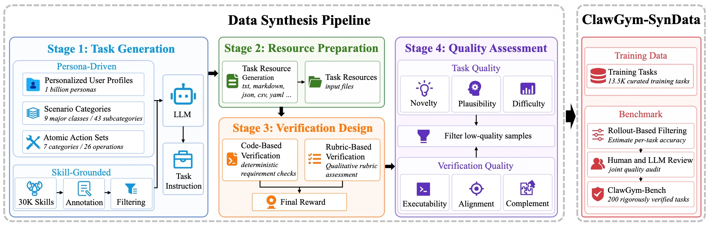
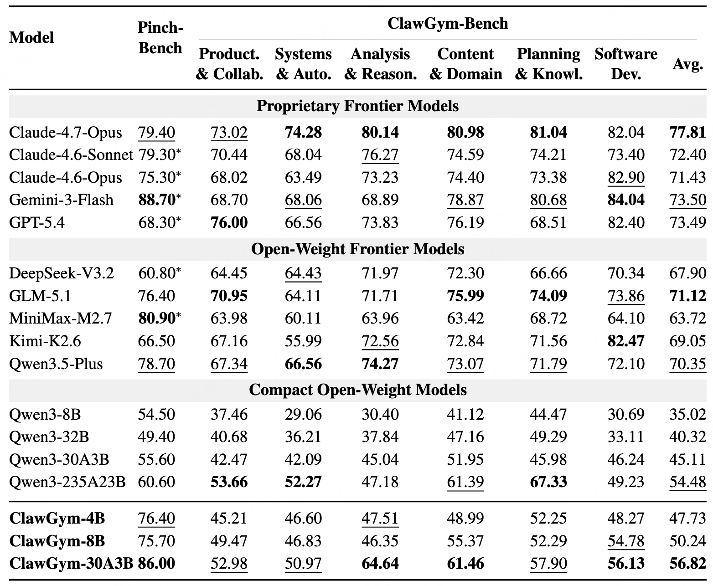

<h1 align="center">ClawGym: A Scalable Framework for Building Effective Claw Agents</h1>

<div align="center">
<a href="https://huggingface.co/"></a>
<a href="https://arxiv.org" target="_blank"></a>
</div>


**ClawGym** is a scalable framework for synthesizing data, training agents, and evaluating Claw-style personal agents in local, stateful workspaces. 👨‍💻

> ⚠️ Code, datasets, benchmark assets, and model checkpoints are currently under internal company review and will be released soon. 🙏

<h5 align="center"> If you like our project, please give us a star ⭐ on GitHub for the latest update.</h5>

## ✨ News

- **[2026.05.01]** 🚀 We release **Claw Series Part I**: **ClawGym**, our first work on scalable data synthesis, training, and evaluation for Claw-style agents.

## 💡 Overview

**ClawGym** is a scalable framework for building, training, and evaluating Claw-style personal agents across realistic local workspace environments.

ClawGym supports the full lifecycle of personal-agent development. It first constructs **ClawGym-SynData**, a diverse dataset of **13.5K executable tasks** synthesized from persona-driven intents and skill-grounded operations. Each task is paired with a realistic mock workspace and hybrid verification mechanisms, enabling reproducible execution and automated evaluation.

Based on these synthesized tasks, we collect interaction trajectories through black-box rollouts and use them to train a family of capable Claw-style models, termed **ClawGym-Agents**. We further explore reinforcement learning (RL) through a lightweight sandbox-parallel pipeline, supports both Docker-based and Docker-free backends, and learns directly from outcome rewards.

To support reliable evaluation, we build **ClawGym-Bench**, a **200-instance benchmark** calibrated through automated filtering and human-LLM review.


## 🧩 ClawGym-SynData
<p align="center">
  
</p>

**ClawGym-SynData** contains **13.5K executable Claw-style tasks**. It combines two synthesis routes:

- **Persona-driven synthesis**: samples user profiles, scenario categories, and atomic operations to generate realistic workspace-grounded requests.
- **Skill-grounded synthesis**: builds tasks from OpenClaw skills, using one primary skill with optional supporting skills to encourage multi-step workflows.

The task generation process covers **9 scenario categories**, **43 subcategories**, **7 operation categories**, and **26 atomic operations**. For skill-grounded synthesis, we annotate **16,837** collected skills across categories such as Data & APIs, Dev Tools, Workflows, Automation, Security, Prompts, MCP Tools, and others.

Each task is paired with lightweight mock resources and task-specific verifiers. Human-sampled quality analysis over 50 training tasks gives an overall score of **4.06 / 5**, indicating good task coherence, resource consistency, and verifier quality.

## 🤖 ClawGym-Agents

**ClawGym-Agents** are trained from black-box OpenClaw rollouts on ClawGym-SynData. We collect **24.5K interaction trajectories** using teacher rollouts from MiniMax-M2.5 and GLM-5.1, then filter trajectories by verifier scores.

The selected trajectories are long-horizon and tool-intensive:

| Avg. Rounds | Avg. Tokens | Avg. Tool Calls | Avg. Tool Types |
| ---: | ---: | ---: | ---: |
| 13.00 | 18.67K | 15.82 | 3.25 |

We perform multi-turn SFT on Qwen3-series backbones and obtain **ClawGym-4B**, **ClawGym-8B**, and **ClawGym-30B-A3B**. We also explore reinforcement learning (RL) through a lightweight sandbox-parallel pipeline.

## 🧪 ClawGym-Bench

**ClawGym-Bench** is a **200-task** diagnostic benchmark for Claw-style agents. Each task contains a user instruction, mock workspace resources, and a task-specific verifier.

- **156** tasks use code-based verification.
- **44** tasks use hybrid verification, combining code checks with rubric-based judgment.
- Hybrid scoring uses **0.7** weight for code-based verification and **0.3** weight for rubric-based verification.

The benchmark is selected through difficulty-aware filtering and human-LLM review. It covers six workspace-grounded categories:

---
| Category | Product.<br>& Collab. | Systems<br>& Auto. | Analysis<br>& Reason. | Content<br>& Domain | Planning<br>& Knowl. | Software<br>Dev. |
| :--- | :---: | :---: | :---: | :---: | :---: | :---: |
| **# Tasks** | 44 | 42 | 35 | 28 | 26 | 25 |
---

## 📊 Results

We evaluate ClawGym-Agents on **ClawGym-Bench** and **PinchBench**. The main results show that training on ClawGym-SynData consistently improves compact open-weight backbones.
<p align="center">
  
</p>

## 🙏 Acknowledgements

Our implementation builds upon the excellent codebases of [slime](https://github.com/THUDM/slime), [OpenClaw](https://github.com/openclaw/openclaw), [OpenClaw-RL](https://github.com/Gen-Verse/OpenClaw-RL), [PinchBench](https://pinchbench.com/), [OpenRLHF](https://github.com/openrlhf/openrlhf) and [Megatron-LM](https://github.com/nvidia/megatron-lm). 

We sincerely thank these projects for their valuable insights and high-quality implementations, which have greatly facilitated our research.


## 📄 Citation

```bibtex
@article{bai2026clawgym,
  title   = {ClawGym: A Scalable Framework for Building Effective Claw Agents},
  author  = {Bai, Fei and Song, Huatong and Sun, Shuang and Cheng, Daixuan and Yang, Yike and Hao, Chuan and Li, Renyuan and Chang, Feng and Wei, Yuan and Tao, Ran and Dai, Bryan and Yang, Jian and Zhao, Wayne Xin},
  journal = {Technical Report},
  year    = {2026}
}
```

## 📞 Contact
For any questions or feedback, please reach out to us at [baifei@ruc.edu.cn](baifei@ruc.edu.cn), [songhuatong123@ruc.edu.cn](songhuatong123@ruc.edu.cn), [sunshuang@ruc.edu.cn](sunshuang@ruc.edu.cn).


